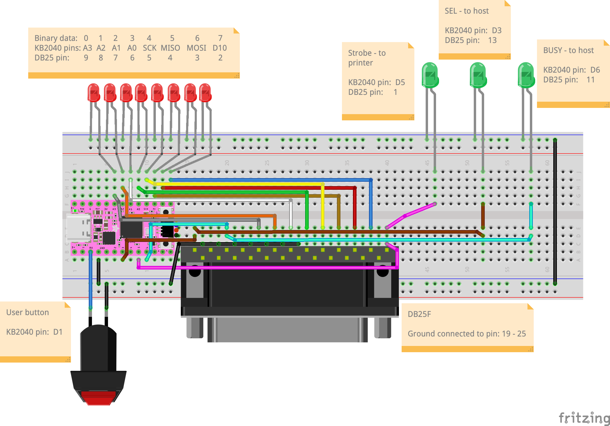
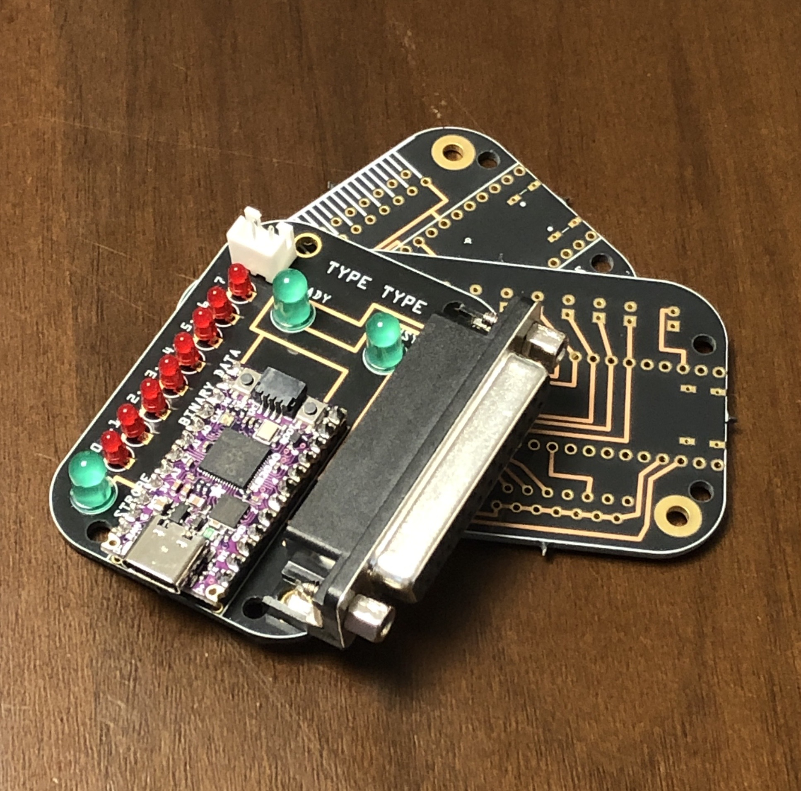

# type-type
This project uses an Adafruit KB2040 board to send parallel data to an electronic typewriter via its Centronics port.

## What is Happening Here?
The KB2040 has at its heart the Raspberry Pi RP2040 chip, running CircuitPython. The program ingests a text file, and sends the data character by character until it reaches a newline, at which point the typewriter sends a busy signal, and taps out its text buffer. Once the typewriter is no longer "busy" the code sends more characters, repeating the process until the file is completely printed. The KB2040 is wired directly to a DB-25 connector which in turn connects to a DB-25 to Centronics cable in order to send data back and forth.

## Wait, But How?
Thank goodness the parallel printer port is clearly defined, and it is (reasonably!) easy to mess around with! With a lot of help from an interesting writeup on [making a fake parallel printer](https://tomverbeure.github.io/2023/01/24/Fake-Parallel-Printer-Capture-Tool-HW.html) by [@tomverbeure](https://github.com/tomverbeure), I was able to get a sense of the necessary pins and timings required to send parallel data. This project uses the KB2040 to set high values on a series of pins connected to the parallel ports data pins, as well as the port's "STROBE" pin. During every STROBE cycle, the high/low pins are interpreted by the typewriter as a binary character, which it prints after receiving a newline, or certain other escape characters.

### All of these wires go places
To talk to the typewriter (or, at least, my specific model: a Swintec 1146 CMP), I've found all that's needed is to connect to the port's Data pins, the SEL pin, the BUSY pin, and the STROBE pin. The typewriter sets SEL high when its printing capabilities are "online", sets BUSY high if it is...busy, and the microcontroller uses the data and STROBE pins to send characters to the typewriter. Specifically for wiring a Swintec 1146 CMP up to an Adafruit KB2040, it all looks like this:

Name | Direction | KB2040 Pin | DB25 Pin | Description
---|---|---|---|--- 
Data 7 | to typewriter | D10 | 2 | the pins 2 to 9 correspond the binary data from 7 to 0
Data 6 | to typewriter | MOSI | 3 | these pins being high/low indicate the binary data 
Data 5 | to typewriter | MISO | 4 | I found it extremely confusing that the data goes [7:0]
Data 4 | to typewriter | SCK | 5 | but the port pins go [2:9]...but maybe that's just me...
Data 3 | to typewriter | A0 | 6 |
Data 2 | to typewriter | A1 | 7 |
Data 1 | to typewriter | A2 | 8 |
Data 0 | to typewriter | A3 | 9 |
STROBE | to typewriter | D5 | 1 | when STOBE is pulsed low the data is sent to the typewriter
SEL | to microcontroller | D3 | 13 | set to high when the typewriter is "online"
BUSY | to microcontroller | D6 | 11 | high means the typewriter is busy and needs to wait before next data

For good measure I connected the DB25 pins 19 to 25 to ground. On a breadboard it looks something like this:

I was having trouble figuring why my code was still wrong, so I added a row of red LEDS to illuminate the binary data bits I thought I should be sending to the printer. It really helped with debugging, and totally looks cool, so I let them as part of the design when I designed the pcb:

### With lots of help from...
This project all started with seeing a [youtube video showing](https://youtu.be/SpOyk6n5WTw) how an old Olivetti typewriter could print from a modern computer as a generic text printer. I did get my typewriter working using CUPS with a raspberry pi...but for a few reasons I didn't want to rely on the pi in an art installation.

Then at some point I saw this [great video by Ben Eater](https://youtu.be/AHYNxpqKqwo) on interfacing with the RS-232 protocol. The whole thing flew so far over my head, but just seeing him carefully work through the RS-232 protocol was so inspiring when I came to trying to figure out the parallel port.

Then, [@tomverbeure's](https://github.com/tomverbeure) [write-up](https://tomverbeure.github.io/2023/01/24/Fake-Parallel-Printer-Capture-Tool-HW.html) made everything click into place (more or less!), and provided so much good information, including a great [pinout diagram from wikipedia](https://en.wikipedia.org/wiki/Parallel_port#/media/File:25_Pin_D-sub_pinout.svg) and information about the [timing information needed](https://tomverbeure.github.io/assets/parallelprintcap/centronics_protocol.jpg).
